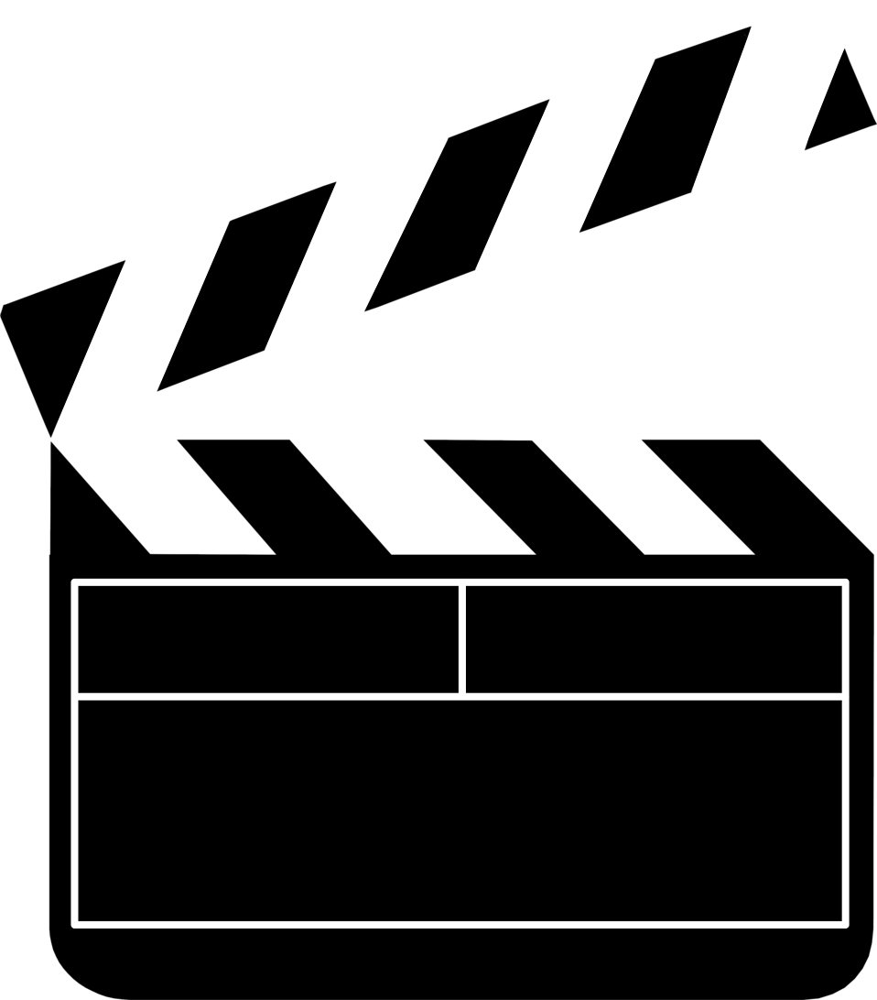

 

  

  <h3 align="center">Portal Filmes</h3>

  

    Um portal de filmes completo e responsivo, com lançamentos, pesquisa e avaliações de usuários.
     
     
     
    <a href="https://ericstefano.github.io/portalFilmes/src/images">Demonstração</a>
  

  
Conteúdo

  <ol>
    <li>
      <a href="#sobre-o-projeto">Sobre o projeto</a>
      <ul>
        <li><a href="#imagens">Imagens</a></li>
      </ul>
    </li>
    <li><a href="#uso">Uso</a></li>
    <li><a href="#licença">Licença</a></li>
    <li><a href="#contato">Contato</a></li>

  </ol>

## Sobre o projeto

Este é um projeto baseado no trabalho/template da disciplina de Desenvolvimento de Interfaces Web (DIW) do ICEI, PUC Minas.
Tive muita dificuldade com a primeira versão [(clique aqui para ver)](https://ericstefano.github.io/trabalhoDiw/). Decidi então refazer da "melhor forma possível" para aprender.

### Imagens

Template

![Layout][layout]

Resultado desktop

![Resultado (Desktop)][desktop]

Resultado mobile

![Resultado (Mobile)][mobile]

Responsivo

![Responsivo][responsivo]

Pesquisa

![Pesquisa][pesquisa]

Navegação

![Navegação][navegação]

Carousel

![Carousel][carousel]

Destaque

![Destaque][destaque]

Avaliações

![Avaliações][avaliações]

Making Of

![MakingOF][makingof]

Novidades

![Novidades][novidades]

Este trabalho me proporcionou muito conhecimento, como por exemplo:

- Utilizar CSS Grid e CSS Flex
- Fazer requisições assíncronas (fetch/then, async/await)
- Utilizar novas implementações do Javascript (ES5, ES6, ES7, ES8...)
- Utilizar APIs
- Noção básica de para que serve o Express.js
- E que fazer projeto web _na unha_ não é uma das melhores ideias 😆...

### Feito com

- [HTML]()
- [CSS]()
- [Javascript]()
- [TheMovieDB-api](https://developers.themoviedb.org/3)
- [Swiper.js](https://swiperjs.com/)
- [Express.js](https://expressjs.com/pt-br/)
- [Github-Pages](https://pages.github.com/)
- [Heroku](https://dashboard.heroku.com/)

## Uso

Acesse o [(link)](https://ericstefano.github.io/portalFilmes/src) para visualizar o site.

## Licença

Distribuído com a licença MIT. Veja `LICENSE.md` para mais informações.

## Contato

Eric Stefano dos Santos Lima - ericstefano12@gmail.com

Link do projeto: [https://github.com/ericstefano/portalFilmes](https://github.com/ericstefano/portalFilmes)

[layout]: /src/images/layout.jpg
[desktop]: /src/images/desktop.png
[mobile]: /src/images/mobile.png
[responsivo]: /src/images/responsivo.gif
[pesquisa]: /src/images/pesquisa.gif
[navegação]: /src/images/navegacao.gif
[carousel]: /src/images/carousel.gif
[destaque]: /src/images/destaque.gif
[avaliações]: /src/images/avaliacoes.gif
[makingof]: /src/images/makingof.gif
[novidades]: /src/images/novidades.gif
